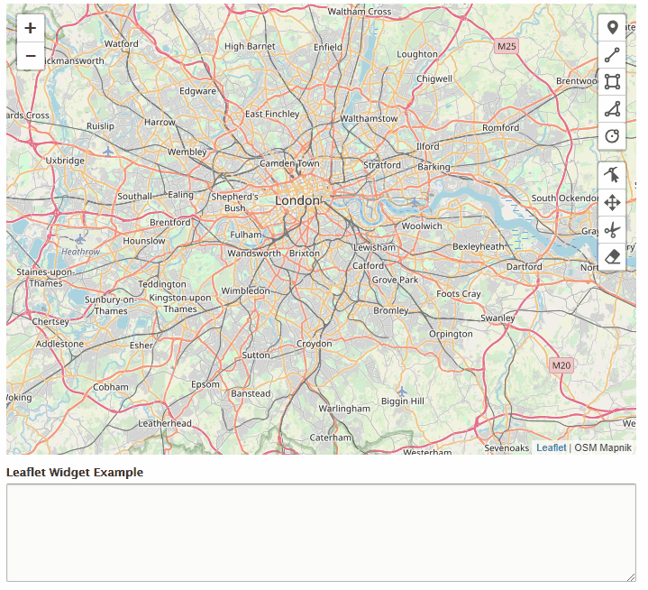
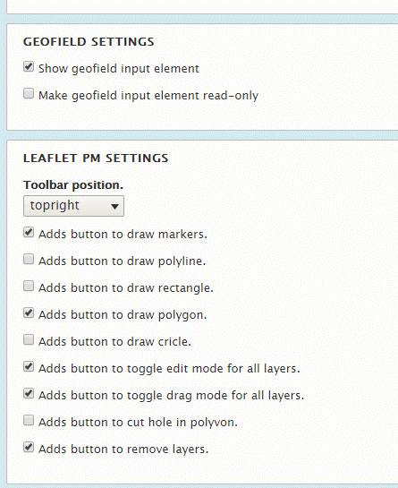

Drupal Leaflet Widget using Leaflet.geoman
==========================================

Allows the selection of geofield values via leaflet maps.

It supports drawing of
- Markers
- Polyline
- Rectangle
- Polygon / Multipolygon

It has
- Edit Mode
- Drag Mode
- Cut Mode
- Delete Mode

The GeoJSON Data is saved in the geofield module.

For drawing of layers it used the library [Leaflet.Geoman](https://github.com/geoman-io/leaflet-geoman) instead of Leaflet.draw:

Because [Leaflet.Draw](http://leaflet.github.io/Leaflet.draw/docs/leaflet-draw-latest.html) does not support MULTIPOLYGON, the Leaflet.Geoman library was used.

Original author
---------------

Originally developed [on GitHub](https://github.com/bforchhammer/leaflet_widget)
by bforchhammer.
